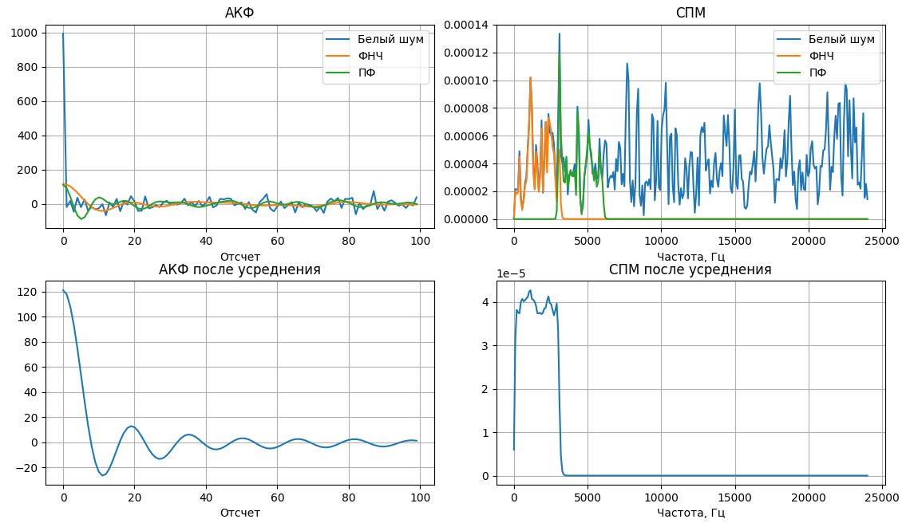
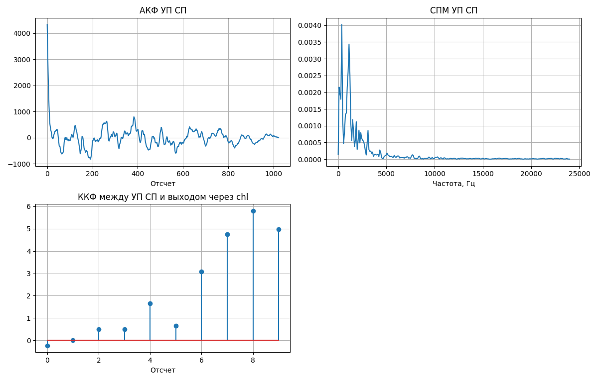

#### **Тема**

Исследование характеристик случайных сигналов, проходящих через фильтры и системы обработки: анализ автокорреляционной функции (АКФ), спектральной плотности мощности (СПМ) и взаимной корреляции.

---

#### **Цель**

1. Исследовать влияние цифровых фильтров (ФНЧ и ПФ) на характеристики белого шума.
2. Построить и проанализировать автокорреляционные функции (АКФ) и спектральные плотности мощности (СПМ) для входных и выходных сигналов.
3. Оценить интервал корреляции для сигнала, прошедшего через ФНЧ.
4. Исследовать поведение сигнала, прошедшего через рекурсивный фильтр с передаточной функцией $ H(z) = \frac{1}{1 - 0.9z^{-1}} $, включая его АКФ, СПМ и взаимную корреляцию с исходным сигналом.

---

#### **Результаты**

##### **1. Анализ белого шума и его преобразования через фильтры**

- **Белый шум** был сгенерирован как гауссовский случайный процесс с нулевым средним и единичной дисперсией. Для анализа использовались:

  - **ФНЧ** (эллиптический фильтр 6-го порядка с частотой среза 3000 Гц).
  - **ПФ** (эллиптический фильтр 6-го порядка с полосой пропускания от 3000 до 6000 Гц).
- **Автокорреляционная функция (АКФ)**:

  - Для белого шума АКФ имеет форму импульса, что характерно для некоррелированных выборок.
  - После фильтрации через ФНЧ и ПФ АКФ становится более "растянутой", что указывает на возникновение корреляции между выборками.
- **Спектральная плотность мощности (СПМ)**:

  - СПМ белого шума равномерна во всем диапазоне частот.
  - Для ФНЧ наблюдается подавление высоких частот, а для ПФ — подавление частот вне заданной полосы.
- **Интервал корреляции** для сигнала, прошедшего через ФНЧ:

  - Вычисленный интервал корреляции составил **0.001 секунды**, что соответствует времени затухания корреляции до уровня $ 1/e $.
- **Графики**:

  - На рисунке ниже представлены графики АКФ и СПМ для белого шума, сигнала после ФНЧ и сигнала после ПФ.

---

##### **2. Анализ сигнала, прошедшего через рекурсивный фильтр**

- Сигнал был обработан рекурсивным фильтром с передаточной функцией $ H(z) = \frac{1}{1 - 0.9z^{-1}} $. Этот фильтр усиливает низкие частоты и подавляет высокие.
- **Автокорреляционная функция (АКФ)**:

  - АКФ сигнала после фильтрации показывает наличие значительной корреляции между соседними выборками, что обусловлено рекурсивной природой фильтра.
- **Спектральная плотность мощности (СПМ)**:

  - СПМ демонстрирует концентрацию энергии на низких частотах, что соответствует свойствам фильтра.
- **Взаимная корреляция (ККФ)**:

  - ККФ между входным сигналом и выходным сигналом, прошедшим через фильтр, показывает наличие сильной связи между сигналами на малых временных задержках.
- **Графики**:

  - На рисунке ниже представлены графики АКФ, СПМ и ККФ для сигнала, прошедшего через рекурсивный фильтр.

---

#### **Выводы**

1. Применение цифровых фильтров (ФНЧ и ПФ) к белому шуму изменяет его статистические характеристики:

   - АКФ становится более "растянутой", что указывает на возникновение корреляции.
   - СПМ отражает частотную селективность фильтров.
2. Интервал корреляции для сигнала, прошедшего через ФНЧ, составляет **0.001 секунды**, что соответствует времени затухания корреляции.
3. Рекурсивный фильтр $ H(z) = \frac{1}{1 - 0.9z^{-1}} $ усиливает низкочастотные компоненты сигнала, что подтверждается формой АКФ и СПМ.
4. Взаимная корреляция между входным и выходным сигналами показывает высокую степень зависимости на малых временных задержках, что согласуется с ожидаемым поведением фильтра.
