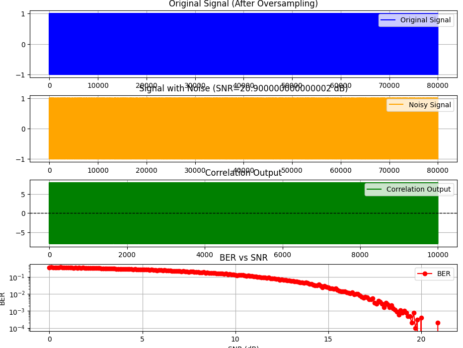

#### **Тема**
Исследование передачи цифровых сигналов в условиях шума: моделирование процесса модуляции, добавления шума, корреляционного приема и оценки вероятности битовых ошибок (BER).

---

#### **Цель**
1. Реализовать процесс цифровой передачи данных с использованием модуляции, оверсэмплинга и добавления шума.
2. Исследовать влияние уровня отношения сигнал/шум (SNR) на качество приема данных.
3. Оценить вероятность битовых ошибок (BER) для различных значений SNR.
4. Визуализировать результаты обработки сигнала: исходный сигнал, сигнал с шумом, выход коррелятора и зависимость BER от SNR.

---

#### **Результаты**

##### **1. Генерация битов и модуляция**
- Была создана последовательность из $ N = 10000 $ случайных битов ($ \{0, 1\} $).
- Применена амплитудная модуляция: $ 1 \to +1 $, $ 0 \to -1 $.

##### **2. Оверсэмплинг**
- Каждый символ был оверсэмплирован с коэффициентом $ L = 8 $. Это позволило увеличить длительность каждого символа до $ L $ семплов, что упрощает дальнейшую обработку.

##### **3. Добавление шума**
- Для моделирования реальных условий передачи к сигналу был добавлен белый гауссовский шум. Уровень шума определялся заданным значением SNR (отношения сигнал/шум в децибелах, dB). Мощность шума вычислялась как:
  $$
  P_{\text{noise}} = \frac{P_{\text{signal}}}{10^{\text{SNR}/10}},
  $$
  где $ P_{\text{signal}} $ — мощность сигнала.

##### **4. Корреляционный прием**
- Для приема сигнала использовался коррелятор, который вычислял корреляцию принятого сигнала с опорным сигналом (в данном случае — сигналом, состоящим из единиц длиной $ L $).
- На основе результата корреляции принималось решение о значении символа: если значение корреляции больше нуля, символ считался равным $ +1 $, иначе $ -1 $.

##### **5. Демодуляция и подсчет ошибок**
- Символы были преобразованы обратно в биты ($ +1 \to 1 $, $ -1 \to 0 $).
- Вычислялась вероятность битовых ошибок (BER), которая определялась как отношение числа ошибочных битов к общему числу переданных битов:
  $$
  \text{BER} = \frac{\text{Number of bit errors}}{N}.
  $$

##### **6. Зависимость BER от SNR**
- Была смоделирована зависимость BER от SNR в диапазоне $ [0, 20] $ dB с шагом $ 0.1 $ dB. Результаты показывают, что с увеличением SNR вероятность ошибок уменьшается.

---

#### **Графики**

1. **Оригинальный сигнал (после оверсэмплинга)**:
   - Показан сигнал после модуляции и оверсэмплинга. Каждый символ представлен $ L = 8 $ семплами.

2. **Сигнал с шумом**:
   - Показан сигнал с добавленным шумом для максимального значения SNR ($ 20 $ dB). Несмотря на шум, форма сигнала остается различимой.

3. **Выход коррелятора**:
   - Показан результат корреляции принятого сигнала с опорным сигналом. Ярко выраженные пики соответствуют границам символов.

4. **Зависимость BER от SNR**:
   - Показана зависимость вероятности битовых ошибок от уровня SNR. При малых значениях SNR BER высокий, но с увеличением SNR он стремится к нулю.

---

#### **Выводы**

1. **Качество приема сигнала**:
   - При низких значениях SNR вероятность ошибок высока, так как шум значительно искажает сигнал.
   - С увеличением SNR качество приема улучшается, и вероятность ошибок стремится к нулю.

2. **Эффективность корреляционного приема**:
   - Корреляционный прием эффективно выделяет полезный сигнал из шума, особенно при высоких значениях SNR.

3. **Практическое применение**:
   - Полученные результаты могут быть использованы для анализа производительности цифровых систем связи в условиях шума.

