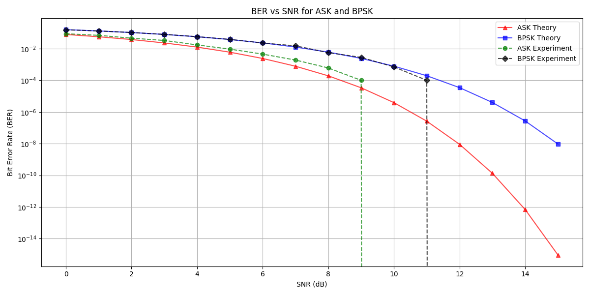

#### **Тема**
Сравнительный анализ вероятности битовых ошибок (BER) для амплитудной манипуляции (ASK) и фазовой манипуляции (BPSK) в зависимости от отношения сигнал/шум (SNR).

---

#### **Цель**
1. Исследовать теоретические и экспериментальные зависимости вероятности битовых ошибок (BER) для ASK и BPSK.
2. Сравнить эффективность этих методов модуляции при различных уровнях SNR.
3. Построить графики зависимостей BER от SNR для обоих методов.

---

#### **Результаты**

##### **1. Теоретические расчеты BER**

- Для **ASK**:
  - Вероятность битовой ошибки вычисляется по формуле:
    $$
    \text{BER}_{\text{ASK}} = Q\left(\sqrt{2 \cdot \text{SNR}}\right),
    $$
    где $ Q(x) = 0.5 \cdot \text{erfc}\left(\frac{x}{\sqrt{2}}\right) $ — функция ошибок.

- Для **BPSK**:
  - Вероятность битовой ошибки вычисляется по формуле:
    $$
    \text{BER}_{\text{BPSK}} = Q\left(\sqrt{\text{SNR}}\right).
    $$

- Теоретические значения BER были рассчитаны для диапазона SNR от 0 до 15 дБ с шагом 1 дБ.

##### **2. Экспериментальная оценка BER**

- **Генерация данных**:
  - Были сгенерированы случайные последовательности битов длиной $ N_{\text{symbols}} = 10000 $ для каждого значения SNR.
  - Для ASK символы формируются как $ A \cdot (2 \cdot b - 1) $, где $ b \in \{0, 1\} $.
  - Для BPSK символы формируются как $ (2 \cdot b - 1) $, где $ b \in \{0, 1\} $.

- **Добавление шума**:
  - Шум моделировался как гауссовский процесс с нулевым средним и стандартным отклонением, зависящим от уровня SNR:
    $$
    \sigma = \sqrt{\frac{E}{\text{SNR}}},
    $$
    где $ E $ — энергия символа.

- **Демодуляция**:
  - Для ASK пороговое значение для принятия решения было установлено как $ V_t = \sqrt{E_{\text{ASK}}} / 2 $.
  - Для BPSK пороговое значение для принятия решения было установлено как $ 0 $.

- **Подсчет ошибок**:
  - Ошибки подсчитывались как количество несовпадений между переданными и принятыми битами.

##### **3. Графики**

- На графике показаны зависимости BER от SNR для ASK и BPSK:
  - Теоретические кривые:
    - Красные треугольники ($ \text{ASK Theory} $).
    - Синие квадраты ($ \text{BPSK Theory} $).
  - Экспериментальные кривые:
    - Зеленые ромбы ($ \text{ASK Experiment} $).
    - Черные ромбы ($ \text{BPSK Experiment} $).

---

#### **Выводы**

1. **Теоретическая и экспериментальная согласованность**:
   - Теоретические и экспериментальные значения BER для ASK и BPSK хорошо согласуются друг с другом, что подтверждает корректность реализации модели.

2. **Сравнение ASK и BPSK**:
   - BPSK демонстрирует значительно лучшую производительность по сравнению с ASK при одинаковых уровнях SNR. Это связано с тем, что BPSK использует фазовую манипуляцию, которая более устойчива к шумам.

3. **Зависимость BER от SNR**:
   - При увеличении SNR вероятность ошибок уменьшается как для ASK, так и для BPSK. Однако снижение BER для BPSK происходит быстрее, чем для ASK.

4. **Практическое применение**:
   - Результаты исследования могут быть использованы для выбора метода модуляции в зависимости от требований к качеству передачи данных и условий канала связи.