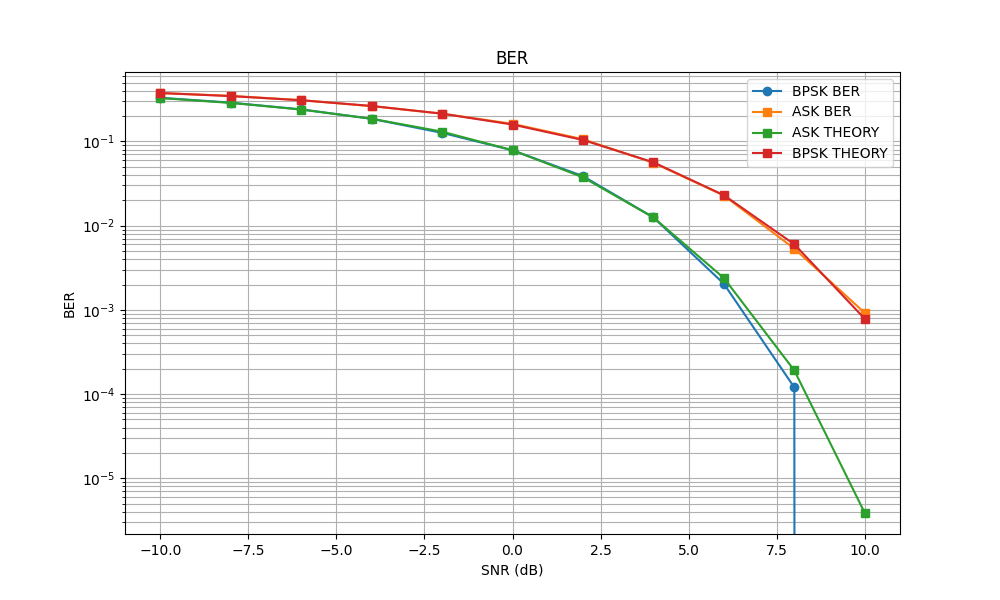

#### **Тема**
Сравнительный анализ вероятности битовых ошибок (BER) для квадратурной амплитудной манипуляции (ASK) и фазовой манипуляции (BPSK) с использованием мягкого решения для демодуляции.

---

#### **Цель**
1. Исследовать теоретические и экспериментальные зависимости вероятности битовых ошибок (BER) для ASK и BPSK.
2. Реализовать мягкое решение для демодуляции, основанное на сравнении расстояний между принятой точкой и референсными символами.
3. Визуализировать созвездия сигналов для ASK и BPSK.
4. Построить графики зависимостей BER от SNR для обоих методов.

---

#### **Результаты**

##### **1. Генерация случайных битов и модуляция**

- Была создана последовательность из $ N = 50000 $ случайных битов ($ \{0, 1\} $).
- Для ASK и BPSK были применены следующие правила модуляции:
  - **BPSK**: $ 0 \to -1 $, $ 1 \to +1 $.
  - **ASK**: $ 0 \to 0 $, $ 1 \to +1 $.

##### **2. Добавление комплексного шума**

- К модулированным сигналам был добавлен комплексный гауссовский шум с нулевым средним и дисперсией, зависящей от уровня SNR:
  $$
  \text{noise\_power} = \frac{\text{signal\_power}}{10^{\text{SNR}/10}},
  $$
  где $\text{signal\_power}$ — мощность сигнала, вычисленная как среднее значение квадрата модуля сигнала.

##### **3. Мягкое решение для демодуляции**

- Для демодуляции использовался метод мягкого решения, основанный на сравнении евклидова расстояния между принятой точкой и референсными символами:
  - Для BPSK: референсные символы $ \{-1, +1\} $.
  - Для ASK: референсные символы $ \{0, +1\} $.
- Принятие решения осуществлялось путем выбора ближайшего символа.

##### **4. Подсчет ошибок и расчет BER**

- Ошибки подсчитывались как количество несовпадений между переданными и принятыми битами.
- Вероятность битовых ошибок (BER) вычислялась как:
  $$
  \text{BER} = \frac{\text{Number of bit errors}}{N}.
  $$

##### **5. Теоретические расчеты BER**

- Для **ASK**:
  $$
  \text{BER}_{\text{ASK}} = Q\left(\sqrt{2 \cdot \text{SNR}}\right),
  $$
  где $ Q(x) = 0.5 \cdot \text{erfc}\left(\frac{x}{\sqrt{2}}\right) $ — функция ошибок.

- Для **BPSK**:
  $$
  \text{BER}_{\text{BPSK}} = Q\left(\sqrt{\text{SNR}}\right).
  $$

##### **6. Графики**

- **График зависимости BER от SNR**:
  - На графике показаны зависимости BER от SNR для ASK и BPSK:
    - Экспериментальные значения:
      - Красные круги ($ \text{BPSK BER} $).
      - Синие квадраты ($ \text{ASK BER} $).
    - Теоретические значения:
      - Зеленые квадраты ($ \text{ASK THEORY} $).
      - Черные квадраты ($ \text{BPSK THEORY} $).

- **Созвездия сигналов**:
  - Для BPSK: точки расположены вблизи референсных значений $ \{-1, +1\} $.
  - Для ASK: точки расположены вблизи референсных значений $ \{0, +1\} $.

---

#### **Выводы**

1. **Теоретическая и экспериментальная согласованность**:
   - Теоретические и экспериментальные значения BER для ASK и BPSK хорошо согласуются друг с другом, что подтверждает корректность реализации модели.

2. **Сравнение ASK и BPSK**:
   - BPSK демонстрирует значительно лучшую производительность по сравнению с ASK при одинаковых уровнях SNR. Это связано с тем, что BPSK использует фазовую манипуляцию, которая более устойчива к шумам.

3. **Мягкое решение для демодуляции**:
   - Использование мягкого решения на основе сравнения расстояний позволяет улучшить точность демодуляции по сравнению с жесткими решениями.

4. **Зависимость BER от SNR**:
   - При увеличении SNR вероятность ошибок уменьшается как для ASK, так и для BPSK. Однако снижение BER для BPSK происходит быстрее, чем для ASK.

5. **Практическое применение**:
   - Результаты исследования могут быть использованы для выбора метода модуляции в зависимости от требований к качеству передачи данных и условий канала связи.
